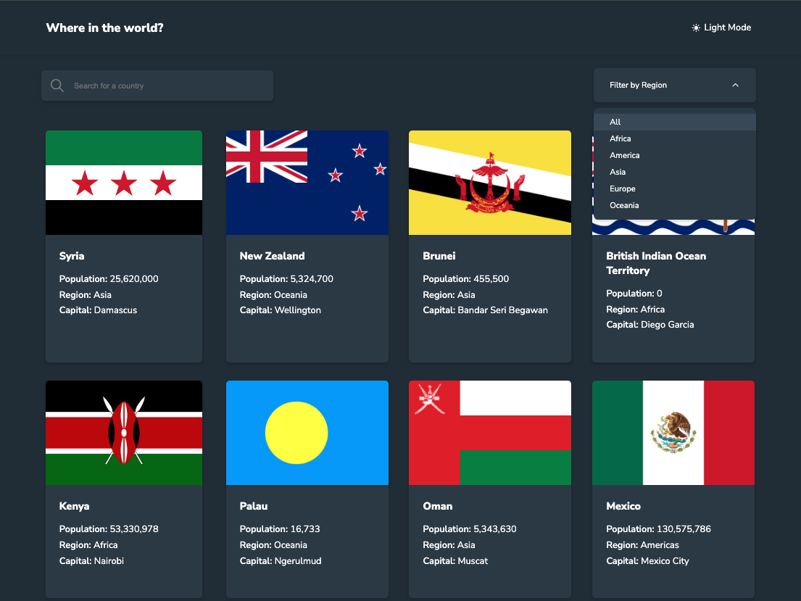
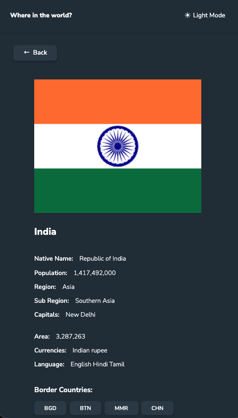
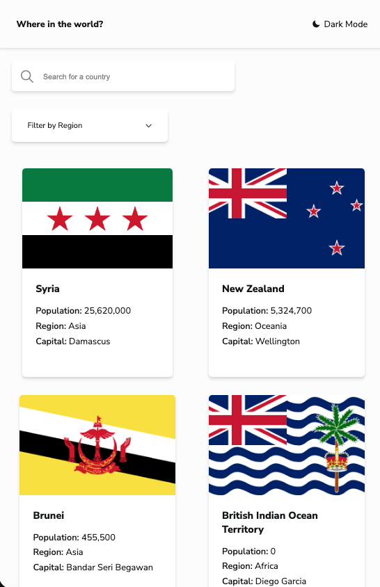

# Frontend Mentor - REST Countries API with color theme switcher solution

## Table of contents

- [Frontend Mentor - REST Countries API with color theme switcher solution](#frontend-mentor---rest-countries-api-with-color-theme-switcher-solution)
  - [Table of contents](#table-of-contents)
  - [Overview](#overview)
    - [The challenge](#the-challenge)
    - [Screenshot](#screenshot)
    - [Links](#links)
  - [My process](#my-process)
    - [Built with](#built-with)
    - [What I learned](#what-i-learned)
    - [Continued development](#continued-development)
  - [Author](#author)

## Overview

### The challenge

Users should be able to:

- See all countries from the API on the homepage : ✅
- Search for a country using an `input` field : ✅
- Filter countries by region : ✅
- Click on a country to see more detailed information on a separate page: ✅
- Click through to the border countries on the detail page : ✅
- Toggle the color scheme between light and dark mode : ✅

### Screenshot





### Links

- Solution URL: [Add solution URL here](https://your-solution-url.com)
- Live Site URL: https://worldwiki.netlify.app/
- Github URL: https://github.com/prabhashranjaner/FEM-REST-Countries

## My process

### Built with

- Semantic HTML5 markup
- CSS custom properties
- Flexbox
- CSS Grid
- Mobile-first workflow
- TypeScript
- [React](https://reactjs.org/) - JS library
- [Styled Components](https://styled-components.com/) - For styles
- React-Query
- ContextAPi - For Theme
- React-Router - For Routing

### What I learned

> React-query: While making this I used React-Query to make query. Before I used to use useEffect for the same thing. I am still new to this.

Small Trick I learned from [https://css-tricks.com/emoji-as-a-favicon/] to use emoji as Favicon.

```
00 100%22><text y=%22.9em%22 font-size=%2290%22>🎯</text></svg>">

```

### Continued development

- Need More practice of TypeScript, Styled Componet & React Query
- Still not comfortable with CSS Grid

## Author

- Website - Prabhash Ranjan
- Frontend Mentor - [@prabhashranjaner](https://www.frontendmentor.io/profile/prabhashranjaner)
- X - [@prabhash\_\_dev](https://x.com/prabhash__dev)
